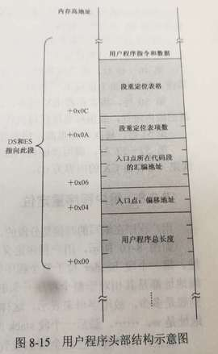

# Chapter 8

> 1. The **MBR**/_loader program_ load the **user program** to MBR's Data segment
> 2. Realloc user program 
> 3. Handover authority 
> 4. 在用户程序中增加对硬盘和显卡的访问与控制

```asm
  jmp far [0x04] 
```


